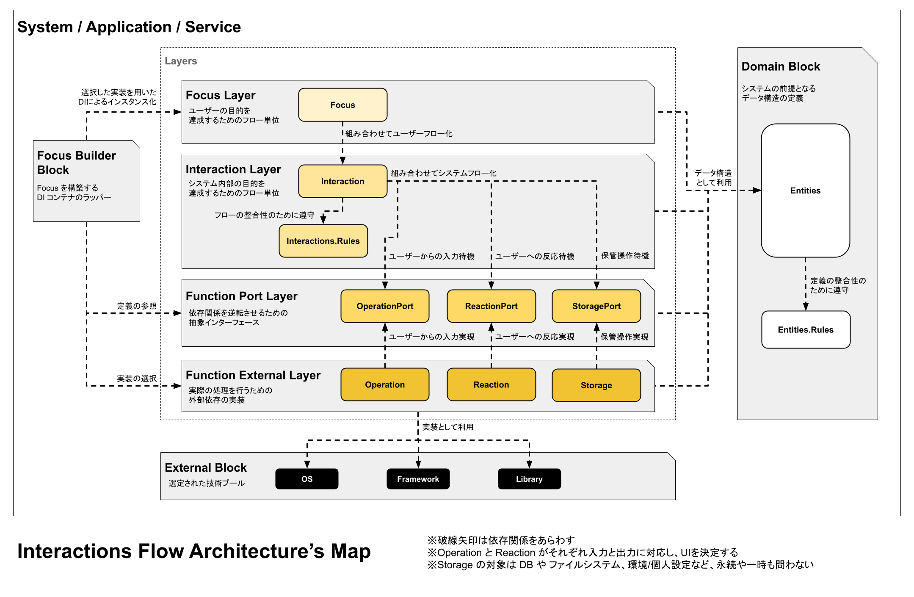

# Interaction Flow C# Package

このプロジェクトは、Interaction Flow Architecture を C# で実現するためのベースライブラリです。

## ソリューション構成

本パッケージは、以下のプロジェクトで構成されています。
- `InteractionFlow.Core`  
  基礎となるインターフェースや構造を提供するライブラリ

- `InteractionFlow.Standard`  
  コンソール操作など、汎用的な実装を提供するライブラリ

- `InteractionFlow.Analyzers`  
  アーキテクチャの依存関係ルールを検証し、設計違反を検出する Roslyn アナライザー

- `InteractionFlow.Sample.Parrot`  
  コンソールベースのオウム返しアプリケーションによる、基本構成のサンプル実装

# Interaction Flow Architecture

Interaction Flow Architecture は、クリーンアーキテクチャと同様の高いテスト耐性と拡張性を備えています。

さらに、構造の認知しやすさと責任範囲の明確化を徹底することで、実装単位や責務、コードの配置が自然に導かれるよう設計されています。  
開発者は「どこに何を書くべきか」を意識的に判断する必要がなくなり、設計の迷いを大きく減らすことができます。  

また、この構造に従うことで、UX を損なわないフロー設計が自然に導かれます。

# 全体構成

本アーキテクチャは、以下の要素で構成されます：

- 4つの Layer（層）
- 3つの Block（補助構造）

各要素は、それぞれ対応する名前空間（およびディレクトリ）を持ちます。

以下は、本アーキテクチャの構造と依存関係の全体像です。

# Layers

## Focus Layer

**namespace**  
`ProjectName.Focuses.{FocusName}`

**役割**  
ユーザーの目的を達成するためのフロー単位です。  
ユーザーにとって「単一の意味」を持つ単位として設計されます。

**構成**  
- 1つのユーザー目的に対して1つのクラス（または構造体）で構成

## Interaction Layer

**namespace**  
`ProjectName.Interactions.{InteractionName}`

**役割**  
システム内部の目的を達成するためのフロー単位です。  
システムにとって「単一の意味」を持つ処理単位として設計されます。

**特徴**

- Port 層を経由して機能を呼び出す
- ユーザー入力を受け取り、処理に適用する
- 保存操作やユーザーへの反応を実行する

**構成**  
- 1つのシステム目的に対して1つのクラス（または構造体）で構成

### Interaction Rules

**namespace**  
`ProjectName.Interactions.Rules.{InteractionRuleName}`

**役割**  
複数の Interaction 間で共有されるべきルールを定義します。

**制約**
- `ProjectName.Interactions` 内からのみ参照可能

## Function Port Layer

**namespace**  
`ProjectName.{Operation|Storage|Reaction}Ports.{PortName}`

**役割**  
依存関係を逆転させるための抽象インターフェース群です。

**特徴**
- 外部機能を interface として定義
- 実装の差し替えを可能にする

## Function External Layer

**namespace**  
`ProjectName.{Operations|Storages|Reactions}.{ExternalFunctionName}`

**役割**  
実際の処理を行う、外部依存の実装です。

**分類**

- **Operations**  
  ユーザー入力や条件の取得を担当（UI / Controller 相当）

- **Storages**  
  状態の保存・管理を担当（DB / FileSystem / Gateway 相当）

- **Reactions**  
  ユーザーに観測可能な出力を担当（UI / Presenter 相当）

# Blocks

## Domain Block

**namespace**  
`ProjectName.Entities.{EntityName}`

**役割**  
システムの前提となるデータ構造（エンティティ）を定義します。

### Entity Rules

**namespace**  
`ProjectName.Entities.Rules.{EntityRuleName}`

**役割**  
エンティティに対する制約やルールを定義します。

**制約**
- `ProjectName.Entities` 内からのみ参照可能

## Focus Builder Block

**namespace**  
`ProjectName.Builders`

**役割**  
DI コンテナのラッパーとして、Focus の構築を担います。

**特徴**
- Port を介して External 実装を注入
- Focus の実行環境を構成する

## External Block

**役割**  
OS、Framework、ライブラリなどの外部要素です。

※本アーキテクチャの管理対象外

# フローと依存関係

このアーキテクチャでは、依存関係の逆転により実行フローと依存関係が明確に分離されます。

## 実行フロー

ユーザー視点の処理は、以下の順で流れます：

    Focus → Interaction → Port → External

## 依存関係

依存関係は次のようになります：

    Focus → Interaction → Port ← External

- External のみが外部に依存します

    External → External Block

- Builder は以下に依存します

    Focus Builder → Focus / Port / External

- すべての要素は Domain に依存します

    All Layers & Blocks → Domain

# 概念モデル

## Focus / Interaction / Function

### Focus（焦点）

ユーザーにとっての意味単位です。  
複数の Interaction を組み合わせてユーザーフローを構成します。

### Interaction（作用）

システム内部の意味単位です。  
Function Port を介して複数の Function（機能）を実行し、それらを組み合わせてシステムフローを構成します。

### Function（機能）

処理の実体です。

- Operation（ユーザーからの入力）
- Storage（状態管理）
- Reaction（ユーザーへの出力）

これらは Port によって抽象化され、External によって実装されます。

# 振る舞いの違い

## 中断

- Function は中断（例外・キャンセル）を持つ
- Focus / Interaction は中断を持たない

ただし実際には：

> Focus / Interaction は中断を適切に完了し、その結果をユーザーに伝えることで、常に正常終了として扱う

## 状態
- Function（Operation / Storage / Reaction）のみが、必要に応じて Mutable な状態を持つことができる
- Focus / Interaction は Immutable

また、Focus / Interaction はフロー中の遷移状態は持てますが、フローのスコープ終了時に必ず破棄されます。

# 制約とアンチパターン

## Focus の制約

- Port および External に依存しない
- ユーザーにとって単一の意味と目的を持つ
- 必ず「明確な終了」を示す Interaction を持つ

### アンチパターン

- ユーザーの目的を持たない Focus

  ※ただし、単一 Interaction のラップは許可される

## Interaction の制約

- Port に依存するが、External には依存しない
- Focus に依存しない
- システム内で単一の意味と目的を持つ
- 必ず終了を示す Reaction を持つ

### アンチパターン

- 過度に巨大な Interaction

## 補足

Focus / Interaction の粒度はチームで調整可能です。
ただし、前述したアンチパターンにならないように注意する必要があります。

# 設計指針（名前空間）

各 Layer / Block は、名前空間およびディレクトリ構造と一致させることを推奨します。

さらに、アルファベット順に並べることで、おおよそ処理フロー順に配置されます。

これにより：

- 構造とコードの対応が明確になる
- 認知負荷が下がる
- 保守性が向上する
