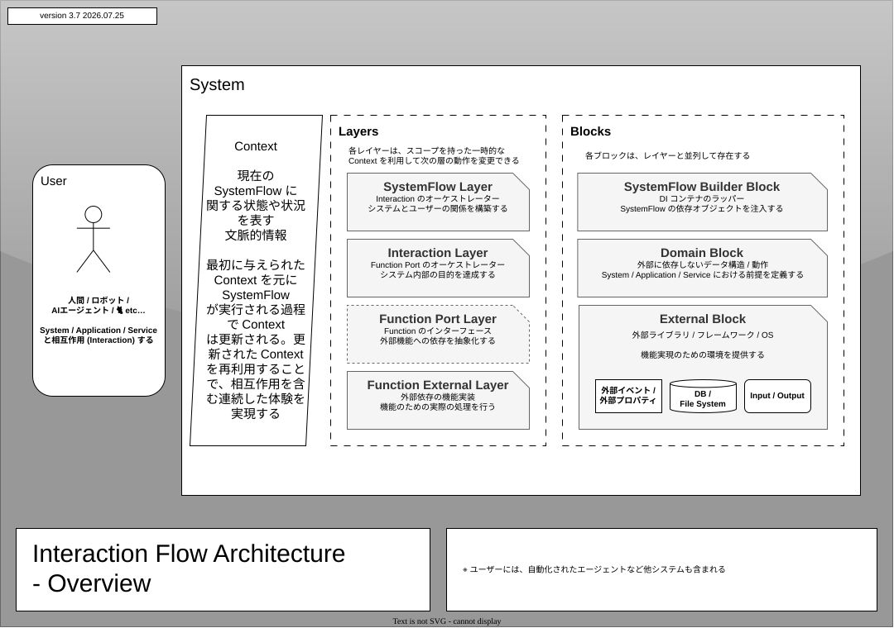
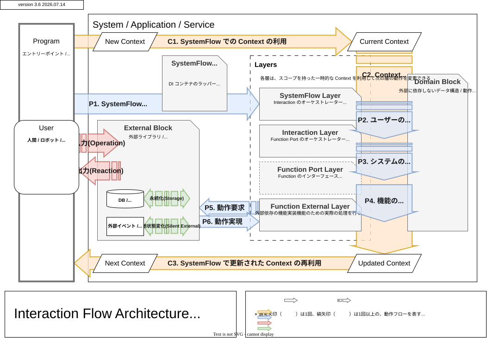
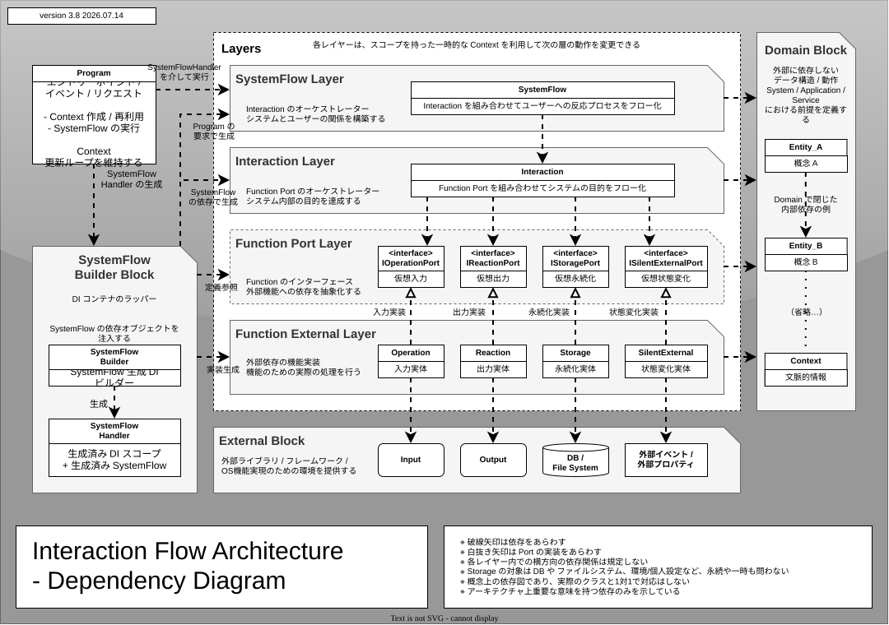

# Interaction Flow Architecture

<p align="center">
  
</p>

<p align="center">
  <i>
    Interaction shapes Context, <br>
    and Context shapes Interaction.
  </i>
</p>

Interaction Flow Architecture は、System を「コードの配置」だけではなく、User と System の間に続く Interaction と Context の循環として設計するためのアーキテクチャです。

このリポジトリは、その考え方を C# / .NET で実装するためのベースライブラリ、標準実装、Analyzer、サンプルを提供します。

## 目次 (Table of Contents)

- [ビジョン (Vision)](#vision)
- [ランタイム (Runtime)](#runtime)
- [開発 (Development)](#development)
- [ランタイム × 開発 (Runtime × Development)](#runtime-development)
- [哲学 (Philosophy)](#philosophy)
- [パッケージ (Packages)](#packages)
- [はじめに (Getting Started)](#getting-started)
- [サンプル (Examples)](#examples)
- [ロードマップ (Roadmap)](#roadmap)
- [補足資料 (References)](#references)
- [確認が必要な点 (Open Questions)](#open-questions)

---

<a id="vision"></a>

# ビジョン (Vision)

## なぜ新しいアーキテクチャなのか？ (Why a New Architecture?)

レイヤードアーキテクチャやクリーンアーキテクチャは、コードの依存方向や責務分離を整理する強力な考え方です。一方で、対話的な UI、ゲームループ、エージェント、複雑な入力と出力を持つアプリケーションでは、開発者が本当に設計したいものは「どのクラスをどこに置くか」だけではありません。

設計したいものは、User が何を行い、System がどう受け取り、何を返し、その結果として次の Interaction がどう変わるかです。

Interaction Flow Architecture は、この流れを `Interaction` と `Context` を中心に表現します。Runtime では User が System を体験し、Development では開発者が同じ構造をコードとして設計し、AI はその構造を読み取って補助します。

このアーキテクチャでは、コードが偶然 User 体験 (UX) を生むのではなく、User 体験を設計した結果がコードになります。Architecture は単なる整理規則ではなく、User 体験を直接設計するための制約でもあります。

この README の基本用語は `Context` と `Meta Context` です。`Context` は、プログラムの Architecture 上で `SystemFlow` や `Interaction` に渡される状態、状況、文脈的情報を指します。`Meta Context` は、開発者や AI が設計意図を理解するために読む README、図、命名、型、コメントなどの文脈です。`Runtime Context` は基本用語ではなく、`Meta Context` と明示的に対比したい箇所でだけ、実行時の `Context` を指す説明表現として使います。

## コアコンセプト (Core Concept)

> Interaction shapes Context, and Context shapes Interaction.

Interaction の実行を通じて Context は更新されます。更新された Context は、次に選ばれる Interaction、User が受け取る反応、必要になる入力、次回以降に残る情報を変えます。

この循環が最小単位です。

```text
Interaction -> Context -> next Interaction -> next Context -> ...
```

この README では、次の言葉を共通言語として使います。まず Runtime と Development の両方で共有する概念を定義し、その後に Development で具体化し、Runtime では補助的に参照する実装語彙を置きます。

共有概念:

- `User`: System と相互作用する主体。人間だけでなく、AI エージェント、ロボット、他システムも含みます。
- `System`: User の行為を Context の中で解釈し、Reaction と次の Context を返す対象。
- `SystemFlow`: System 側が User への反応プロセスとして Interaction を束ねる単位。
- `Interaction`: システム内部の目的を達成する意味単位。
- `Context`: 現在の SystemFlow に関する状態、状況、文脈的情報。単なる state ではなく、次の Interaction を変える意味づけを含みます。
- `Meta Context`: 開発者や AI が設計意図を理解するために読む文脈。

実装で使う語彙:

- `Function`: Interaction から呼び出される外部機能の単位。Port と External に分けて扱います。
  - `Function Port`: Interaction から見える外部機能の抽象契約。
  - `Function External`: Port を実装する具体的な外部依存。
  - `Operation`: User からの入力や外部条件の取得。
  - `Reaction`: User が観測できる出力や終了時の反応。
  - `Storage`: 永続または一時の状態管理。
  - `SilentExternal`: User に直接見えない外部状態や外部イベントの扱い。
- `External`: UI、DB、ファイルシステム、OS、外部サービスなど、Function External が接続する具体的な実行環境。



代替テキスト: [InteractionFlowArchitecture_Overview.context.md](./docs/img/InteractionFlowArchitecture_Overview.context.md)

---

<a id="runtime"></a>

# ランタイム (Runtime)

> ユーザーが System とどのように関わるか。

## ユーザー体験 (User Experience)

User から見た System は、画面や API エンドポイントの集合ではなく、Interaction と Context の連続です。

たとえば、同じボタンを押しても、ログイン前とログイン後では意味が変わります。同じ入力でも、前の会話、保存済みデータ、権限、現在の選択状態によって System の反応は変わります。つまり、体験は「操作そのもの」ではなく「Context の中で解釈された Interaction」です。

Interaction Flow Architecture は、この体験の連続性を Runtime の中心に置きます。

## 最初の Interaction (First Interaction)

🚪 ドアを開閉する (Open / Close the Door)

最小の Context Loop は、ドアの例で考えると直感的です。

```text
1. User が Open または Close を入力する
2. System は現在の Context を見る
3. ドアが閉まっていて、入力が Open なら、ドアを開ける
4. ドアが開いていて、入力が Close なら、ドアを閉める
5. すでに同じ状態なら、その状態を Reaction として返す
```

ここで重要なのは、Interaction が単独で意味を持つのではないことです。同じ `Open` という入力でも、Context が「閉じている」なら開けられ、「開いている」ならすでに開いているという Reaction になります。そして、その結果として更新された Context が、次の Interaction を形作ります。

## Context Loop

Context Loop は、User の操作と System の反応によって Context が更新され、その更新済み Context が次の体験に影響する循環です。



代替テキスト: [InteractionFlowArchitecture_FlowDiagram.context.md](./docs/img/InteractionFlowArchitecture_FlowDiagram.context.md)

User から見ると、流れは次のように見えます。

- User が何かを行う。
- System は現在の Context の中で、その行為の意味を解釈する。
- System は User に観測できる反応を返す。
- その結果として Context が変わる。
- 変わった Context によって、次に可能な行為や反応が変わる。

System 全体は、単一の巨大なフローではなく、複数の Context Loop の集合として設計できます。

## ランタイムモデル (Runtime Model)

Runtime は、User から見える体験の流れとして読みます。ここで使う `Operation`、`Reaction`、`Storage`、`SilentExternal` は実装クラスの説明ではなく、体験上の役割を指すための補助用語です。

- User が何かを行う (`Operation`): 入力、選択、操作、外部から起きる変化。
- System は現在の文脈を見る (`Context`): その行為がどのような意味を持つかを決める状況。
- 行為が体験上の意味になる (`Interaction`): User の行為が Context の中で解釈されたもの。
- User が反応を受け取る (`Reaction`): 表示、応答、完了、キャンセル、エラー。
- 次回以降の体験に影響する情報が残る (`Storage`): User の次の体験に影響する記憶。
- User には直接見えない条件が体験を変える (`SilentExternal`): 権限、時刻、接続状態、外部イベントなど。

ここでは、UI、DB、ファイル、DI、クラス構成などの実装詳細は扱いません。Runtime で説明するのは、User がどの Context で何を行い、System がどの Reaction を返し、その結果として次の体験がどう変わるかです。

## ユーザーフローとして読む (Reading as User Flow)

Runtime では、Interaction Flow を User の体験として読みます。

重要なのは、「どの画面に何があるか」よりも、「User はどの Context で何を行い、System はどの Context と Reaction を返すか」です。

この見方にすると、画面、CLI、API、AI エージェント、ゲームループなどの入出力形態が違っても、User が体験している意味を同じ言葉で説明できます。

---

<a id="development"></a>

# 開発 (Development)

> 開発者が System とどのように関わるか。

## 開発体験 (Development Experience)

Development は、Runtime で読んだ User Flow を実装構造へ写す視点です。開発者は、SystemFlow や Interaction に渡される Context そのものと、それを設計・理解するための Meta Context の両方を扱います。ここでは両者を対比するため、前者を Runtime Context と呼ぶことがあります。

コードを書くことは、単に処理を並べることではありません。どの Context を受け取り、どの Interaction を実行し、どの Port を通じて外部に触れ、どの Reaction で終えるかを定義することです。README、図、命名、型、コメントは、その設計判断を開発者や AI が読むための Meta Context になります。

このアーキテクチャでは、開発者の判断が次の問いに集約されます。

- この目的は `SystemFlow` か、`Interaction` か。
- この値は Context か、Domain の Entity か、Storage に保存される Data か。
- この外部依存は Operation / Reaction / Storage / SilentExternal のどれか。
- この依存は Port と External の境界を越えていないか。

## ユーザー体験を実装へ写す (Translating User Experience)

Development では、Runtime で読んだ User Flow を実装へ写します。

UI を中心に考えると、「どの画面に何を置くか」が先に立ちます。Interaction を中心に考えると、「User はどの Context で何を行い、System はどの Context と Reaction を返すべきか」が先に立ちます。

この順序にすると、入出力形態が変わっても、体験の意味を保ったまま実装を差し替えやすくなります。

## 実装フロー (Implementation Flow)

Development では、Runtime で見えていた User Flow を、実装可能な単位へ分解します。

```text
Program -> SystemFlow -> Interaction -> Function Port -> Function External -> External
```

各要素の役割は次のように分かれます。

- `Program`: エントリーポイント、イベント、リクエストを受け取り、初期 Context と依存関係を組み立てる。
- `SystemFlow`: User への反応プロセスとして Interaction の順序と終了の意味を構成する。
- `Interaction`: Context を読み、Function Port を組み合わせて、意味ある Context 更新と Reaction を構成する。
- `Function Port`: Interaction から見える外部機能の抽象契約。
- `Function External`: Port を実装し、具体的な実行環境へ接続する。
- `External`: UI、Console、DB、ファイルシステム、OS、外部サービスなどの実行環境。

実装フローの目的は、User Flow の意味を保ったまま、どこに Context を置き、どこに外部依存との境界を置くかを決めることです。Runtime で説明した体験上の流れを、Development では型、クラス、Port、External、DI の組み立てとして表現します。

## Interaction Flow を設計する (Designing Interaction Flow)

Interaction は、システム内部における単一の意味を持つ処理単位として設計します。

大きすぎる Interaction は、Context 更新の理由が読みにくくなります。小さすぎる Interaction は、システム内での意味を失い、単なる関数分割になります。目安は「User から見えない内部目的として、名前を付けられるか」です。

SystemFlow は、User への反応プロセスとして Interaction を束ねます。SystemFlow は全システムの処理手順ではなく、User と System の関係として一つの意味を持つ単位です。

## Context を設計する (Designing Context)

Context は、フローの現在地を表す文脈です。単なる mutable state ではなく、次の Interaction を決めるために共有される情報です。

設計時は、次の境界を明確にします。

- `FlowContext`: フローに渡される基本の文脈。
- `ScopedFlowContext`: フロー中だけ追加される一時的な文脈。
- Domain Entity: System の前提として外部に依存しない概念。
- Storage Data: 保存、復元、共有の対象になる情報。

Context は広げすぎると何でも入る袋になります。狭すぎると Interaction 間の関係がコード外に漏れます。所有者、ライフサイクル、更新理由が説明できる範囲で定義します。

## Context の更新を制御する (Controlling Context Updates)

Context は誰でも自由に更新できるものではありません。

- `Function` は、Port / External の境界を通じて外部機能を扱う。
  - `Operation` は、User 入力や外部条件を読み取る。
  - `Reaction` は、User へ結果を返し、終了状態を表す。
  - `Storage` は、永続または一時の状態を保存、復元する。
  - `SilentExternal` は、User に直接見えない外部状態や外部イベントを扱う。
- `Interaction` は、これらの Function Port を組み合わせて Context の意味ある更新を構成する。
- `SystemFlow` は、Interaction の順序と終了の意味を構成する。

この分担により、Context 更新の理由が Interaction Flow 上に残ります。

## デザイン言語としてのコード (Code as a Design Language)

コードは、Architecture の説明そのものです。

Interaction Flow Architecture では、コードを書くこと自体が System 設計になります。API、型、命名、責務は実装詳細ではなく、User 体験をどの単位で分け、どの Context を次へ渡すかを表す設計語彙です。

### 責務 (Responsibilities)

各クラス、各コンポーネントは一つの責務だけを持ちます。

`SystemFlow` は Interaction を束ねます。`Interaction` は Port を束ねます。`Function Port` は外部機能を抽象化します。`Function External` は具体的な外部依存を扱います。`Domain` は外部に依存しない前提を定義します。

責務が混ざると、Context がどこで形成され、どこで更新されたのかが読めなくなります。

### API設計 (API Design)

API は Interaction Flow を自然に表現できる形にします。

このリポジトリでは、`SystemFlow<TContext>`、`Interaction`、`IFlowContext`、`FlowEndToken`、`ReactionEnd`、`ScopeBuilder`、`SystemFlowBuilder` などが、フローの意味をそのままコードに写すための基盤になっています。

Builder は DI コンテナの詳細を隠すのではなく、SystemFlow とその依存スコープを明示的に組み立てるために使います。

Builder のスコープ構造、親スコープとの合成、ライフタイム管理の詳細は、[SystemFlow Builder の詳細](./docs/SystemFlowBuilder.md) にまとめています。

### 命名 (Naming)

命名は、Interaction と Context を中心にします。

- User への反応プロセスは `SystemFlows` に置く。
- システム内部の意味単位は `Interactions` に置く。
- 外部依存の抽象は `ExternalPorts` に置く。
- 外部依存の実装は `Externals` に置く。
- 外部に依存しない概念は `Entities` に置く。
- 構築処理は `Builders` に置く。

名前空間とディレクトリを一致させることで、構造がそのままドキュメントになります。

### 型 (Types)

型は、設計意図を表すために使います。

Context の型は、どの SystemFlow が何を前提に実行されるかを表します。Port の型は、Interaction がどの外部機能を必要としているかを表します。Domain の型は、System が外部に依存せずに保持する概念を表します。

型によって責務を表すことで、アーキテクチャの境界をコード補完、コンパイル、Analyzer に乗せられます。

### ドキュメント (Documentation)

ドキュメントは、実行時の Context ではなく Meta Context の一部です。

README は、プロジェクト全体の共有 Meta Context です。図は構造を短時間で復元するために残し、コメントはコードだけでは読み取れない設計判断に絞って残します。

ドキュメントの責務は、実装そのものを繰り返すことではなく、開発者や AI が設計意図を復元できる文脈を保つことです。

### Analyzer

Analyzer は、人間の注意力だけに依存せず、アーキテクチャのルールを検査するための仕組みです。

依存関係の規約、Layer / Block の境界、Port と External の分離は、レビューだけで守るには忘れやすいものです。Analyzer によって設計ルールを開発環境に近づけることで、Architecture を「読んで守るもの」から「書きながら支援されるもの」にします。

## AIとの協調 (AI Collaboration)

AI は Meta Context を読み取り、Context を扱うコードを補助する存在です。

Interaction Flow Architecture は、AI に渡す Meta Context を圧縮します。ファイル構成、名前空間、図、README、Analyzer のルールが揃っていると、AI は「この変更はどの責務に属するか」「どの境界を越えてはいけないか」を短い文脈で復元できます。

ここでの焦点は、何をドキュメントに残すかではなく、残された Meta Context を使って AI がどのように協調できるかです。Architecture は AI のためだけにあるものではありません。人間と AI が読む量を減らしたうえで、同じ責務境界を共有するための技術です。

人間はモデルを設計し、AI はモデルを展開します。人間は意味と境界を決め、AI はその境界の内側で実装、検証、反復を支援します。AI に依存しない構造を先に置くことで、AI を安全に活用しやすくなります。



代替テキスト: [InteractionFlowArchitecture_DependencyDiagram.context.md](./docs/img/InteractionFlowArchitecture_DependencyDiagram.context.md)

---

<a id="runtime-development"></a>

# ランタイム × 開発 (Runtime × Development)

## 二つの視点 (Two Perspectives)

Runtime と Development は、別々のループを持つのではありません。同じ Interaction と Context のループを、別の立場から見ています。

Runtime では、User がそのループを体験します。User は何かを行い、System から反応を受け取り、更新された Context によって次の Interaction が変わることを体験します。

Development では、開発者が同じループを実装として設計します。どの Context を持ち、どの Interaction がそれを読み、どの Function Port を通じて Operation / Reaction / Storage / SilentExternal を扱うかを決めます。

```text
Shared loop:
  Interaction -> Context -> next Interaction -> next Context -> ...

Runtime:
  User experiences the loop.

Development:
  Developer designs the same loop.
```

Meta Context は、この同じループを開発者や AI が短く復元するために残す文脈です。

## 一つの共有モデル (One Shared Model)

共有する中心概念は二つです。

- `Interaction Flow`
- `Context`

Users experience it.
Developers design it.
AI learns it.

User は Interaction Flow と Context の変化を体験します。開発者は同じ Interaction Flow と Context を設計します。AI は Meta Context からその構造を学習し、実装や検証を補助します。

この三者が同じ Interaction / Context Loop を共有できることが、このアーキテクチャの実用上の価値です。開発者が実装を考えるときにも、「User は今どの Context にいて、どの Interaction を行い、どの Reaction を受け取るのか」を基準にできます。

その結果、ユーザー目線の開発が特別な工程ではなく、日常の設計判断になります。クラス分割、Port の境界、Storage の扱い、Reaction の設計は、すべて User Flow を保つための選択として説明できます。実装の都合で User Flow が見えなくなったときも、共有された Interaction と Context に戻ることで、設計判断を立て直せます。

---

<a id="philosophy"></a>

# 哲学 (Philosophy)

<p align="center">
  
</p>

<p align="center">
  <i>
    Interaction shapes Context, <br>
    and Context shapes Interaction.
  </i>
</p>

## Interaction

Interaction は、User と System の間に起きる作用であり、System 内部では目的を持った状態遷移のまとまりです。

Interaction は、User が一方的に実行する命令でも、System が一方的に返す処理でもありません。User と System の境界で成立し、現在の Context によって成立条件と意味が決まります。

Interaction は単なる関数呼び出しではありません。現在の Context の中で成立し、その結果として Context を次へ進める意味単位です。実装上の分解は Development の章で扱います。

このアーキテクチャが Interaction を中心に置くのは、User 体験が Interaction の連続として現れるからです。

## Context

Context は、現在の SystemFlow に関する状態、状況、文脈的情報です。

Context は state と似ていますが、意味が少し違います。state は値そのものに注目します。Context は、その値が次の Interaction をどう変えるかに注目します。

たとえば「ログイン済み」という値は state です。その値によって「ノート一覧を表示できる」「編集できる」「ログイン画面に戻す」といった次の Interaction が決まるとき、それは Context として働きます。

## 共有 Meta Context (Shared Meta Context)

人、AI、System は、それぞれ違う形で Context と Meta Context を扱います。

System は Context を使って Interaction を進めます。User はその結果を体験として受け取ります。開発者は Context をコードとして設計し、その設計意図を README、図、命名、型、コメントという Meta Context に残します。AI はその Meta Context を読み取り、Context を扱う実装を補助します。

共有 Meta Context が明確であるほど、協調は楽になります。説明が短くなり、誤解が減り、変更の影響範囲が見えやすくなります。

## アーキテクチャは共有 Meta Context である (Architecture as Shared Meta Context)

Architecture は、コードのルール集だけではありません。

Architecture は、チームと AI をつなぎ、User 体験の設計判断を共有する Meta Context です。どこに何を書くか、どの責務を混ぜないか、どの言葉で設計を語るかを揃えることで、User 体験と実装の構造が同じ方向を向きます。

Interaction Flow Architecture は、User の体験、開発者の実装、AI の理解を、Interaction、Context、Meta Context の関係として整理します。

## 計算モデルとしての補助線 (Computational Model)

この節は、Interaction Flow Architecture の中心思想を置き換えるものではなく、実装モデルを別の角度から検証するための補助資料です。

Interaction Flow Architecture の Function (Port / External) は、チューリングマシンとしても説明できます。

この見方では、Function Port / Function External の子要素である Operation / Reaction / Storage / SilentExternal は、「読み取り、書き込み、外部への作用」を担うテープ操作に相当します。Interaction と Context の循環を、計算モデルとして検証しやすくするための見方です。

詳しい説明は [計算モデルとしての Interaction Flow アーキテクチャ](./docs/ComputationalModel.md) を参照してください。

---

<a id="packages"></a>

# パッケージ (Packages)

主要な役割分担として、抽象と契約を置く `Core`、再利用可能な標準実装を置く `Standard`、具体例と検証を担う `Samples` を分けています。各プロジェクトの責務と更新方針は [Core / Standard / Samples の役割](./docs/RoleOfMainProjects.md) にまとめています。

## Core

`InteractionFlow.Core` は、アーキテクチャ概念を構造と振る舞いとして定義する最小パッケージです。

- Target Framework: `netstandard2.1`
- 主な要素: `SystemFlow`、`Interaction`、`IFlowContext`、`FlowContext`、`ScopedFlowContext`、`FlowEndToken`
- Port: `IOperationPort`、`IReactionPort`、`IStoragePort`、`ISilentExternalPort`
- 役割: 外部実装や UI に依存しない Core の契約を提供する

Core には、Standard や Samples に依存する実装を入れません。

## Standard

`InteractionFlow.Standard` は、Core を現実のユースケースで扱いやすい形に整えた標準実装です。

- Target Framework: `netstandard2.1`
- DI: `ScopeBuilder`、`SystemFlowBuilder`、`ScopeHandler`、`SystemFlowHandler`
- Console: コンソール Operation / Reaction / SilentExternal の標準実装
- FileSystem: ファイル、ディレクトリ永続化の標準実装
- Serialization: stream / text serializer の標準実装

通常は `InteractionFlow.Standard` から始めるのが最短です。

## Analyzer

`InteractionFlow.Analyzers` は、Interaction Flow Architecture の依存関係ルールを検査する Roslyn Analyzer です。

- Target Framework: `netstandard2.0`
- 役割: Layer / Block の境界、依存関係の規約、アーキテクチャ違反を開発時に検出する
- 推奨: アプリケーション側では `PrivateAssets="all"` を付けて参照する

## Samples

`InteractionFlow.Samples.*` は、Architecture の使い方を具体例として確認するためのプロジェクト群です。

- 役割: Runtime の Context Loop が Development の実装構造へどう写るかを確認する
- 方針: 実験的な使い方や検証を Samples 側に閉じ込め、Core / Standard の責務を濁さない
- 導線: 個別サンプルの目的と読み方は [サンプル (Examples)](#examples) にまとめています

## PackageInstallCheck

`InteractionFlow.PackageInstallCheck` は、パッケージ導入確認用の補助プロジェクトです。Samples の学習用フローではなく、公開パッケージとして参照したときに最小構成が成立するかを確認するために使います。

---

<a id="getting-started"></a>

# はじめに (Getting Started)

## インストール (Installation)

NuGet から利用する場合は、標準実装を含む `InteractionFlow.Standard` から始めます。

```bash
dotnet add package InteractionFlow.Standard
```

設計ルールの検査も有効にする場合は Analyzer を追加します。

```bash
dotnet add package InteractionFlow.Analyzers
```

プロジェクトファイルに直接書く場合は、Analyzer に `PrivateAssets="all"` を付けることを推奨します。

```xml
<ItemGroup>
  <PackageReference Include="InteractionFlow.Standard" Version="0.4.1" />
  <PackageReference Include="InteractionFlow.Analyzers" Version="0.4.2" PrivateAssets="all" />
</ItemGroup>
```

このリポジトリを直接動かす場合は、.NET SDK `9.0.313` 以降の latest feature roll-forward が使われます。

```bash
dotnet build InteractionFlow.slnx
```

## Hello Door 🚪

Hello Door は、最初の Context Loop を理解するための最小例です。単なる Hello World ではなく、User が System へ入る最小の入口 (Entrance) として扱います。

```text
Context:
  Door is closed

Interaction:
  Operate the Door

Operation:
  User inputs "Open" or "Close"

Reaction:
  "The door opens."

Updated Context:
  Door is open
```

このサンプルでは、Operation と Reaction を Console 外部依存として実装し、`Program` クラスから SystemFlow を実行します。実装は `InteractionFlow.Samples.HelloDoor` にあり、README のコードはファイル単位で同じ責務に対応しています。

実行する場合は、次のコマンドを使います。

```bash
dotnet run --project InteractionFlow.Samples.HelloDoor/InteractionFlow.Samples.HelloDoor.csproj
```

**Step 1.** User 入力を Interaction が扱うコマンドとして定義します。

`Entities/DoorCommand.cs`

```csharp
namespace InteractionFlow.Samples.HelloDoor.Entities
{
    internal enum DoorCommand
    {
        Open,
        Close,
        Exit,
        Unknown,
    }
}
```

**Step 2.** Context に載せるドアの状態を定義します。`IsOpen` は現在の開閉状態、`ExitRequested` は SystemFlow のループ終了要求です。

`Entities/DoorState.cs`

```csharp
namespace InteractionFlow.Samples.HelloDoor.Entities
{
    internal sealed class DoorState
    {
        public bool IsOpen { get; set; }

        public bool ExitRequested { get; set; }
    }
}
```

**Step 3.** Interaction から見える入力 Port を定義します。Interaction は Console を直接読まず、この Port だけを呼びます。

`ExternalPorts/OperationPorts/IDoorOperation.cs`

```csharp
using InteractionFlow.Core.Entities.Contexts;
using InteractionFlow.Core.ExternalPorts.OperationPorts;
using InteractionFlow.Samples.HelloDoor.Entities;
using System.Threading.Tasks;

namespace InteractionFlow.Samples.HelloDoor.ExternalPorts.OperationPorts
{
    internal interface IDoorOperation : IOperationPort
    {
        ValueTask<DoorCommand> ReadCommandAsync(IFlowContext context);
    }
}
```

**Step 4.** Interaction から見える出力 Port を定義します。直前に入力された `DoorCommand` を受け取り、`DoorState` Context の更新と結果表示を担当します。

`ExternalPorts/ReactionPorts/IDoorReaction.cs`

```csharp
using InteractionFlow.Core.Entities.Contexts;
using InteractionFlow.Core.ExternalPorts.ReactionPorts;
using InteractionFlow.Samples.HelloDoor.Entities;
using System.Threading.Tasks;

namespace InteractionFlow.Samples.HelloDoor.ExternalPorts.ReactionPorts
{
    internal interface IDoorReaction : IReactionPort
    {
        ValueTask<ReactionEnd> ReactAsync(IFlowContext context, DoorCommand command);
    }
}
```

**Step 5.** 入力 Port を Console で実装します。ここが Operation の External 実装です。

`Externals/Operations/ConsoleDoorOperation.cs`

```csharp
using InteractionFlow.Core.Entities.Contexts;
using InteractionFlow.Core.Externals.Operations;
using InteractionFlow.Samples.HelloDoor.Entities;
using InteractionFlow.Samples.HelloDoor.ExternalPorts.OperationPorts;
using System;
using System.Threading.Tasks;

namespace InteractionFlow.Samples.HelloDoor.Externals.Operations
{
    internal sealed class ConsoleDoorOperation : Operation, IDoorOperation
    {
        public override void ForceResetMemoryState()
        {
        }

        public ValueTask<DoorCommand> ReadCommandAsync(IFlowContext context)
        {
            Console.Write("Door command (Open/Close, Enter to exit): ");
            var text = Console.ReadLine()?.Trim();

            return new(text?.ToUpperInvariant() switch
            {
                "OPEN" => DoorCommand.Open,
                "CLOSE" => DoorCommand.Close,
                "" or null => DoorCommand.Exit,
                _ => DoorCommand.Unknown,
            });
        }
    }
}
```

**Step 6.** 出力 Port を Console で実装します。ここが Reaction の External 実装で、`DoorCommand` に応じて `DoorState` Context を更新し、User へ結果を表示します。

`Externals/Reactions/ConsoleDoorReaction.cs`

```csharp
using InteractionFlow.Core.Entities.Contexts;
using InteractionFlow.Core.Externals.Reactions;
using InteractionFlow.Samples.HelloDoor.Entities;
using InteractionFlow.Samples.HelloDoor.ExternalPorts.ReactionPorts;
using System;
using System.Threading.Tasks;

namespace InteractionFlow.Samples.HelloDoor.Externals.Reactions
{
    internal sealed class ConsoleDoorReaction : Reaction, IDoorReaction
    {
        public override void ForceResetMemoryState()
        {
        }

        public ValueTask<ReactionEnd> ReactAsync(IFlowContext context, DoorCommand command)
        {
            if (!context.TryGet<DoorState>(out var door))
            {
                Console.WriteLine("No door context.");
                return new(GetEnd());
            }

            Console.WriteLine(GetMessageAndUpdateState(door, command));
            return new(GetEnd());
        }

        private static string GetMessageAndUpdateState(DoorState door, DoorCommand command)
        {
            switch (command)
            {
                case DoorCommand.Open when !door.IsOpen:
                    door.IsOpen = true;
                    return "The door opens.";

                case DoorCommand.Open:
                    return "The door is already open.";

                case DoorCommand.Close when door.IsOpen:
                    door.IsOpen = false;
                    return "The door closes.";

                case DoorCommand.Close:
                    return "The door is already closed.";

                case DoorCommand.Exit:
                    door.ExitRequested = true;
                    return "Goodbye.";

                default:
                    return "Use Open or Close.";
            }
        }
    }
}
```

**Step 7.** Interaction を実装します。ここでは入力を取得し、その直後の `DoorCommand` を Reaction へ渡します。ドア状態の更新と表示は Reaction 側に委譲します。

`Interactions/OperateDoor.cs`

```csharp
using InteractionFlow.Core.Entities.Contexts;
using InteractionFlow.Core.ExternalPorts.ReactionPorts;
using InteractionFlow.Core.Interactions;
using InteractionFlow.Samples.HelloDoor.ExternalPorts.OperationPorts;
using InteractionFlow.Samples.HelloDoor.ExternalPorts.ReactionPorts;
using System;
using System.Threading.Tasks;

namespace InteractionFlow.Samples.HelloDoor.Interactions
{
    internal sealed class OperateDoor(
        IDoorOperation operation,
        IDoorReaction reaction,
        IExceptionPort<Exception> exceptionPort,
        ICancellationPort cancellationPort)
        : Interaction(exceptionPort, cancellationPort, operation, reaction)
    {
        protected override async Task<ReactionEnd> ExecuteCoreAsync(IFlowContext context)
        {
            var command = await operation.ReadCommandAsync(context);
            return await reaction.ReactAsync(context, command);
        }
    }
}
```

**Step 8.** SystemFlow を実装します。`OperateDoor` を繰り返し、Context に終了要求が出るまで Context Loop を継続します。

`SystemFlows/DoorSystemFlow.cs`

```csharp
using InteractionFlow.Core.Entities.Contexts;
using InteractionFlow.Core.SystemFlows;
using InteractionFlow.Samples.HelloDoor.Entities;
using InteractionFlow.Samples.HelloDoor.Interactions;
using System.Threading.Tasks;

namespace InteractionFlow.Samples.HelloDoor.SystemFlows
{
    internal sealed class DoorSystemFlow(OperateDoor operateDoor)
        : SystemFlow<IFlowContext>(operateDoor)
    {
        protected override async Task<FlowEndToken> ExecuteCoreAsync(IFlowContext context)
        {
            FlowEndToken end;

            while (true)
            {
                end = await operateDoor.ExecuteAsync(context);

                if (context.TryGet<DoorState>(out var door) &&
                    door.ExitRequested)
                {
                    break;
                }
            }

            return end;
        }
    }
}
```

**Step 9.** Program で DI、初期 Context、SystemFlow 実行を組み立てます。`OperateDoor` は独自の `IDoorOperation` / `IDoorReaction` だけでなく、`Interaction` 基底クラスが例外やキャンセルを Reaction として扱うための `IExceptionPort<Exception>` / `ICancellationPort` も必要とします。`ConsoleBuilder.Profile` は、この例外/キャンセル表示 Port の Console 実装を登録するために適用します。

`Program.cs`

```csharp
using InteractionFlow.Core.Entities.Contexts;
using InteractionFlow.Samples.HelloDoor.Entities;
using InteractionFlow.Samples.HelloDoor.ExternalPorts.OperationPorts;
using InteractionFlow.Samples.HelloDoor.ExternalPorts.ReactionPorts;
using InteractionFlow.Samples.HelloDoor.Externals.Operations;
using InteractionFlow.Samples.HelloDoor.Externals.Reactions;
using InteractionFlow.Samples.HelloDoor.Interactions;
using InteractionFlow.Samples.HelloDoor.SystemFlows;
using InteractionFlow.Standard.Builders;
using InteractionFlow.Standard.Console.Builders;
using System.Threading.Tasks;

namespace InteractionFlow.Samples.HelloDoor
{
    internal static class Program
    {
        private static async Task Main()
        {
            var builder = new ScopeBuilder();

            // Port と External 実装、Interaction を DI に登録します。
            builder
                // Interaction の基底クラスが利用する例外/キャンセル表示 Port も登録します。
                .Apply(ConsoleBuilder.Profile)
                .UseFunction<IDoorOperation, ConsoleDoorOperation>()
                .UseFunction<IDoorReaction, ConsoleDoorReaction>()
                .UseInteraction<OperateDoor>();

            using var scope = builder.BuildScope();
            using var flow = scope.BuildSystemFlow<DoorSystemFlow, IFlowContext>();

            using var context = new ScopedFlowContext(new FlowContext())
                .With(new DoorState { IsOpen = false });

            await flow.ExecuteAsync(context);
        }
    }
}
```

**結果：**
```text
Door command (Open/Close, Enter to exit): Open
The door opens.
Door command (Open/Close, Enter to exit): Open
The door is already open.
Door command (Open/Close, Enter to exit): Close
The door closes.
Door command (Open/Close, Enter to exit): Close
The door is already closed.
Door command (Open/Close, Enter to exit):
Goodbye.
```

この分割では、`Entities` が Context に載る値、`ExternalPorts` が Interaction から見える外部依存の契約、`Externals` が Console 入出力と DoorState 更新の具体処理、`Interactions` が入力取得から Reaction 呼び出しまでの流れ、`SystemFlows` が Interaction の継続実行、`Program` が DI と初期 Context の組み立てを担当します。`DoorSystemFlow` は `while (true)` で `OperateDoor` を繰り返し、空入力で終了要求が出るまで Context Loop を継続します。

## 次のステップ (Next Step)

学習は次の順序がおすすめです。

1. [コアコンセプト](#core-concept) の概要図で全体構造を読む。
2. [Context Loop](#context-loop) の図で Runtime の循環を読む。
3. [AIとの協調](#ai-collaboration) の依存関係図で Development 側の境界を読む。
4. [docs/RoleOfMainProjects.md](./docs/RoleOfMainProjects.md) で Core / Standard / Samples の役割を確認する。
5. [docs/SystemFlowBuilder.md](./docs/SystemFlowBuilder.md) で Builder と DI スコープを理解する。
6. `InteractionFlow.Samples.HelloDoor` を実行して最小の Context Loop を見る。
7. `InteractionFlow.Samples.Parrot` を実行して Console Port と Storage の組み立てを見る。
8. `InteractionFlow.Samples.Notepad.Core` を読んで、複数 Interaction と Storage を含む構成を見る。

---

<a id="examples"></a>

# サンプル (Examples)

このリポジトリの `Examples` は、実際に存在する `InteractionFlow.Samples.*` プロジェクトに対応しています。

## InteractionFlow.Samples.HelloDoor

`HelloDoor` は、最小構成の Context Loop を確認するためのサンプルです。

- 目的: Context によって同じ Interaction の結果が変わることを確認する
- Context: ドアが開いているか、閉まっているか、終了要求があるか
- Operation: `Open` / `Close` のキーワード入力
- Interaction: `OperateDoor`
- SystemFlow: `DoorSystemFlow`
- 見どころ: 独自 Port / Console External / Interaction / SystemFlow / Program の最小分割

最初に読むサンプルとして位置づけています。詳細な実装手順は [Hello Door](#hello-door-) にあります。

## InteractionFlow.Samples.Parrot

`Parrot` は、Console 標準実装と複数 SystemFlow の組み立てを確認するためのサンプルです。

- 目的: サンプル選択から実行までの会話型フローを確認する
- Context: 選択状態、キャンセル状態、前回選択
- SystemFlow: `InitializeApplication`、`SelectAndRunSample`
- Interaction: `ListSamples`、`SelectSample`、`RunSample`、`ConsoleSetup`
- 見どころ: `ScopedFlowContext`、Memory Storage、Console Profile、依存ツリー表示

`HelloDoor` の次に読むと、Context Loop が複数 Interaction に広がる様子を追いやすくなります。

## InteractionFlow.Samples.Notepad.Core

`Notepad.Core` は、Notepad サンプルの中核となる Core プロジェクトです。

- 目的: Entity / Port / Interaction / SystemFlow の分割を確認する
- Context: `NotepadContext`、`NotepadUserObject`
- Storage: `INotepadDataStoragePort`、`INotepadUserDataStoragePort`
- Interaction: `Login`、`NoteCreate`、`NoteDelete`、`NoteEdit`、`NoteListView`、`SelectUserAction`
- SystemFlow: `MainLoop`
- 見どころ: アプリケーションの中心ルールを実行プロジェクトから分離する構成

実行環境に依存しにくい Interaction Flow を読みたい場合は、このプロジェクトから確認します。

## InteractionFlow.Samples.Notepad

`Notepad` は、`Notepad.Core` を Console アプリとして組み立てる実行サンプルです。

- 目的: Core の Port に標準的な FileSystem / Serialization / Console 実装を接続する
- Context: `NotepadContext`
- Storage: ファイル永続化、ユーザーデータ、ノートデータ
- Program: `ScopeBuilder` で Storage、Serializer、Interaction、`MainLoop` を組み立てる
- 見どころ: Core の設計を具体的な実行環境へ接続する境界

Storage を含む実用寄りの Context Loop を見たい場合に適しています。

## InteractionFlow.Samples.Notepad.Secure

`Notepad.Secure` は、`Notepad` の実行構成を差し替え、セキュアな保存とログインを追加するサンプルです。

- 目的: Core の Interaction Flow を保ったまま、Storage / Serializer / Login を差し替える
- Context: `NotepadContext` と現在ユーザーのセキュア情報
- Storage: `ICurrentUserStoragePort`、ユーザーデータ永続化、暗号化されたノートデータ
- Interaction: `EnterPassword`、`LoginSecure`
- 見どころ: Port / External の境界によって、既存 Flow を拡張できること

差し替え可能な Port 設計と、AI や開発者が読むべき Meta Context を小さく保つ効果を確認できます。

---

<a id="roadmap"></a>

# ロードマップ (Roadmap)

Interaction Flow Architecture は、次の方向で発展させる予定です。

- Core API の安定化
- Standard API の拡充
- Analyzer による依存関係ルール検査の強化
- Unity 向け API セットの開発

---

<a id="references"></a>

# 補足資料 (References)

- [Core / Standard / Samples の役割](./docs/RoleOfMainProjects.md)
- [SystemFlow Builder の詳細](./docs/SystemFlowBuilder.md)
- [計算モデルとしての Interaction Flow アーキテクチャ](./docs/ComputationalModel.md)

---

<a id="open-questions"></a>

# 確認が必要な点 (Open Questions)

後から編集しやすいように、意図が不明または現在のリポジトリとテンプレートの間に差がある点をここにまとめます。

- Installation は NuGet 利用を前提に書いています。公開先、推奨バージョン、未公開パッケージの扱いが変わる場合は調整が必要です。
- Roadmap は既存資料とテンプレートから整理した案です。リリース予定や優先順位として確定しているものではありません。

---

## 目次 (Table of Contents)

[Vision](#vision) | [Runtime](#runtime) | [Development](#development) | [Runtime × Development](#runtime-development) | [Philosophy](#philosophy) | [Packages](#packages) | [Getting Started](#getting-started) | [Examples](#examples) | [Roadmap](#roadmap) | [References](#references) | [Open Questions](#open-questions)
